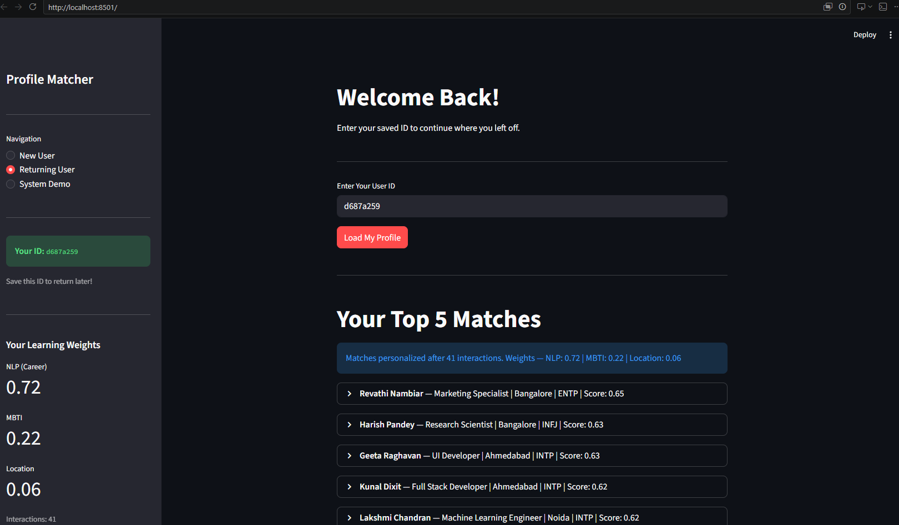
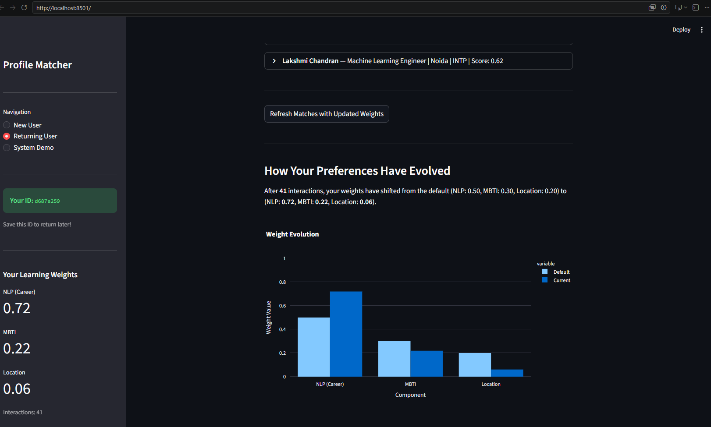
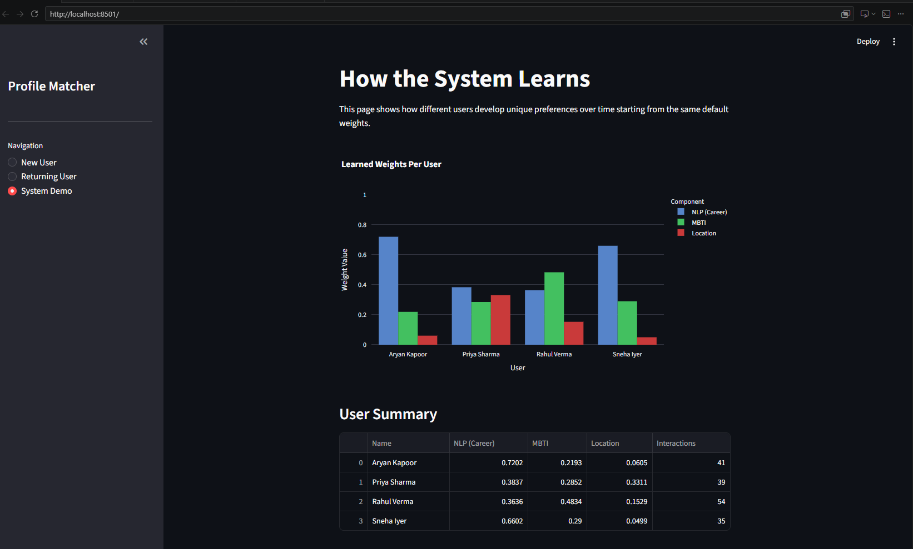

# Hybrid Recommendation System with Adaptive Learning

An end-to-end NLP and machine learning project that matches users based on career goals, personality traits, and location. Features a per-user adaptive scoring engine that learns individual preferences through behavioral feedback.

**Author:** Chintalapati Sai Manas Varma | B.Tech Civil Engineering, IIT Madras  
**Tools:** Python · spaCy · Sentence Transformers · Scikit-learn · Streamlit · Pandas · Plotly

---

## Key Results

| Metric | Value |
|--------|-------|
| Dataset | 100 synthetic user profiles |
| NLP Model | all-MiniLM-L6-v2 (Sentence Transformers) |
| Vector Dimensions | 384 per user |
| Scoring Components | NLP Similarity + MBTI + Location |
| Learning Method | Per-user Gradient Descent with LR Decay |

---

## Project Structure

```
hybrid-recommendation-system/
├── data/
│   ├── users_store.csv         # data of the users that interacted with the App.py
│   ├── users.csv               # 100 synthetic user profiles
│   └── user_vectors.npy        # Precomputed sentence embeddings (generated by Project.ipynb)
├── Data_creation.ipynb         # Synthetic dataset generation
├── Project.ipynb               # Text cleaning + vector precomputation
├── matching_functions.py       # NLP, MBTI, and location scoring logic
├── weights.py                  # Per-user weight storage and gradient descent
├── App.py                      # Streamlit dashboard
└── requirements.txt
```

---

## What This Project Does

### 1. Dataset Creation (`Data_creation.ipynb`)
- Generated 100 realistic synthetic user profiles with diverse professions, locations, MBTI types, and free-text bios.
- Each profile includes: name, age, profession, location, experience, professional summary, about me, interests, and MBTI type.
- MBTI types assigned realistically — analytical roles get INTJ/INTP, leadership roles get ENTJ/ENFJ, creative roles get INFP/ENFP.

### 2. NLP Pipeline (`Project.ipynb`)
- Cleaned free-text fields (professional summary + about me + interests + profession) using spaCy — lemmatization, stopword removal, punctuation removal.
- Encoded cleaned text into 384-dimensional semantic vectors using Sentence Transformers (all-MiniLM-L6-v2).
- Saved all 100 vectors as `user_vectors.npy` for instant loading at runtime — avoids recomputing embeddings on every app launch.

### 3. Hybrid Scoring Engine (`matching_functions.py`)
Three scoring components combined into a single compatibility score:

- **NLP Similarity** — Cosine similarity between the new user's text vector and all 100 precomputed vectors. Captures semantic career and personality alignment.
- **MBTI Compatibility** — Static lookup matrix scoring personality pairings. 
- **Location Score** — Same city = 1.0, same state = 0.3, different state = 0.0.

**Core Formula:**
```
Total Score = (w1 × NLP Score) + (w2 × MBTI Score) + (w3 × Location Score)
```

### 4. Adaptive Learning Engine (`weights.py`)
- Each user gets a unique 8-character ID and their own set of weights (w1, w2, w3) stored in JSON.
- After every Accept (1) or Reject (0), weights update via gradient descent:
```
error = action - predicted_score
w_i += learning_rate × error × score_i
```
- **Learning rate decay** prevents outlier interactions from destabilizing converged weights:
```
lr = 0.1 / (1 + 0.05 × interactions)
```
- Weights are normalized after every update so they always sum to 1.
- Minimum weight floor of 0.05 prevents any component from being completely ignored.

**Observed convergence across 4 test personas (35–54 interactions each):**

| User | Preference | NLP (w1) | MBTI (w2) | Location (w3) |
|------|-----------|----------|-----------|---------------|
| Aryan | Career focused | 0.72 | 0.22 | 0.06 |
| Priya | Career + Location | 0.37 | 0.27 | 0.36 |
| Rahul | MBTI focused | 0.36 | 0.48 | 0.15 |
| Sneha | Career focused | 0.66 | 0.29 | 0.05 |

All 4 users started from the same default weights (0.50, 0.30, 0.20) and converged to distinct patterns based purely on their individual behavior.

### 5. Streamlit Dashboard (`App.py`)
Three pages:

- **New User** — Profile creation form → unique ID generated → top 5 matches shown with score breakdown → Accept/Reject to start personalizing.
- **Returning User** — Enter saved ID → loads personalized weights → shows updated matches.





- **System Demo** — Grouped bar chart comparing learned weights across all users, proving per-user divergence from the same starting point.

 

---

## How to Run Locally

### Prerequisites
- Python 3.x

### Setup

```bash
# 1. Clone the repo
git clone https://github.com/Manas10409/Hybrid-Recommendation-System.git
cd Hybrid-Recommendation-System

# 2. Install dependencies
pip install -r requirements.txt

# 3. Download spaCy model
python -m spacy download en_core_web_sm

# 4. Generate dataset (run once)
# Open and run all cells in Data_creation.ipynb
# This saves data/users.csv

# 5. Generate user vectors (run once)
# Open and run all cells in Project.ipynb
# This saves data/user_vectors.npy

# 5. Launch the app
streamlit run App.py
# Note: System Demo page is pre-loaded with 4 test personas
# showing weight convergence after 35-54 interactions each
```

---

## Technical Design Decisions

**Why per-user weights instead of a global model?**  
Global weights receive contradictory signals from users with different preferences and never converge. Per-user weights ensure gradient descent receives consistent signal from one person's behavior.

**Why Sentence Transformers over TF-IDF?**  
Sentence Transformers capture semantic meaning — "machine learning engineer" and "AI researcher" are recognized as similar even without shared keywords. TF-IDF relies purely on keyword overlap.

**Why learning rate decay?**  
Without decay, a single outlier interaction (accepting someone out of curiosity) can destabilize weights that took 30+ interactions to converge. Decay makes the system increasingly confident over time.

**Why NLP is more tunable than MBTI and Location?**  
NLP scores are continuous (0.1–0.9), giving gradient descent a varied signal every interaction. MBTI and location are discrete (only 3–5 possible values), so the gradient signal is often identical across matches — a fundamental feature discrimination limitation.

---

## Requirements

```
streamlit
pandas
numpy
scikit-learn
spacy
sentence-transformers
plotly
```
